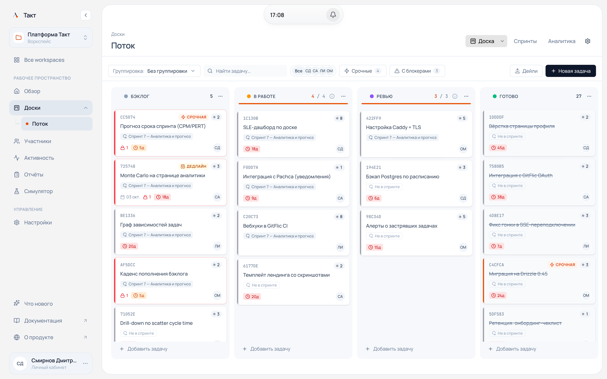
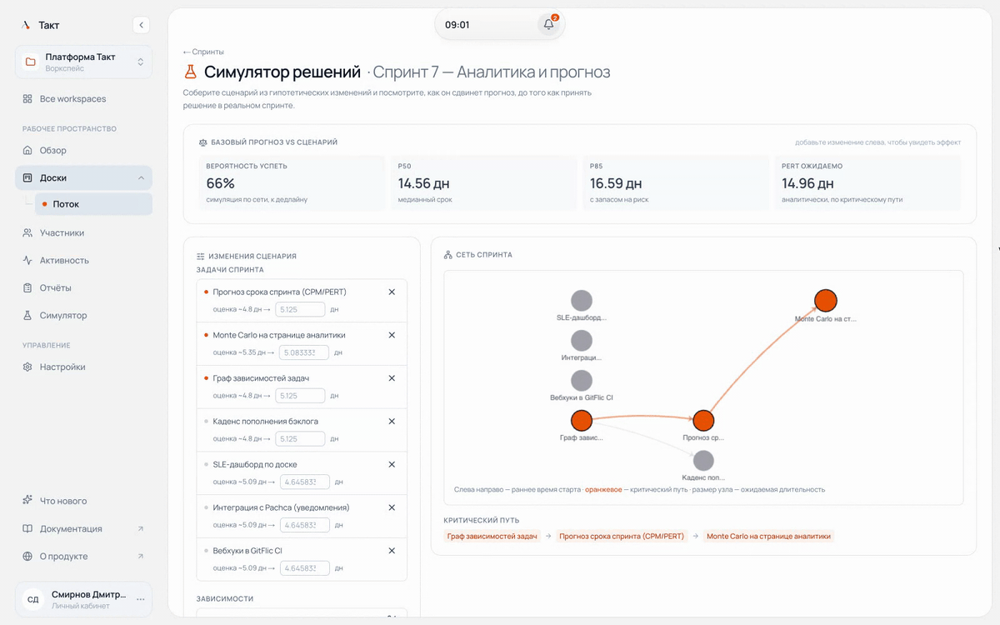
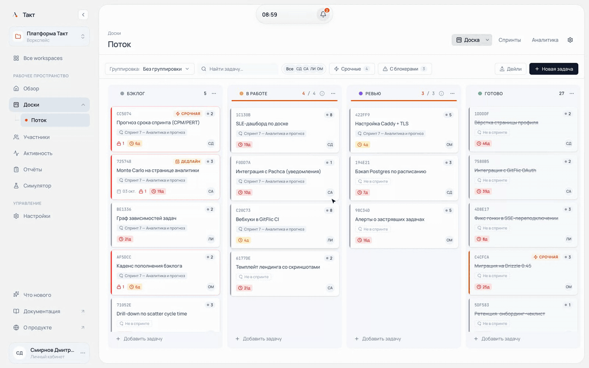
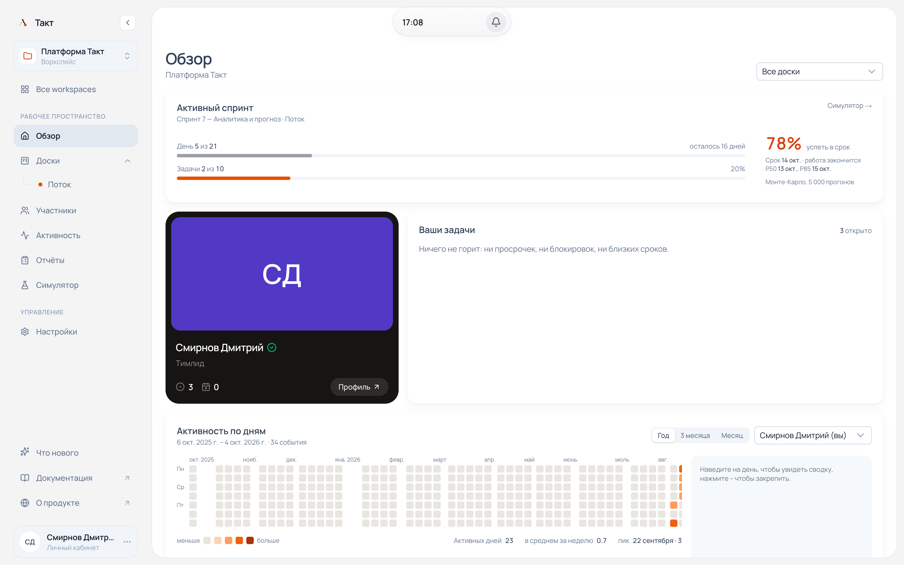
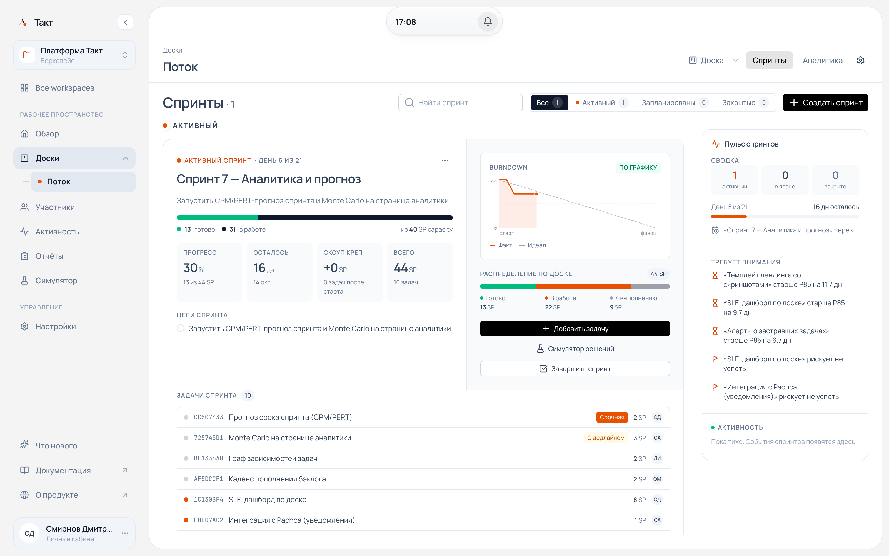
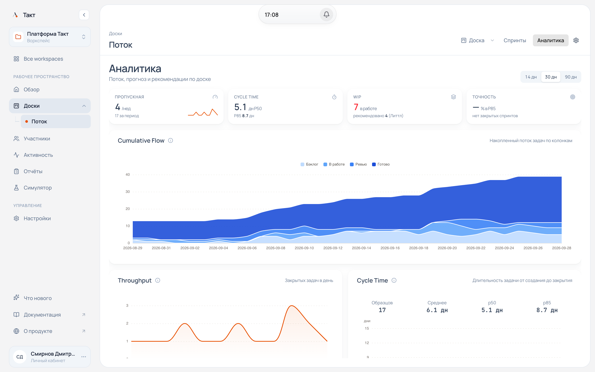
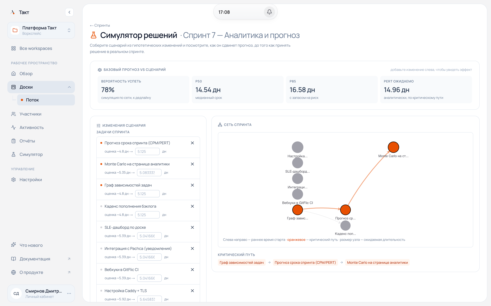
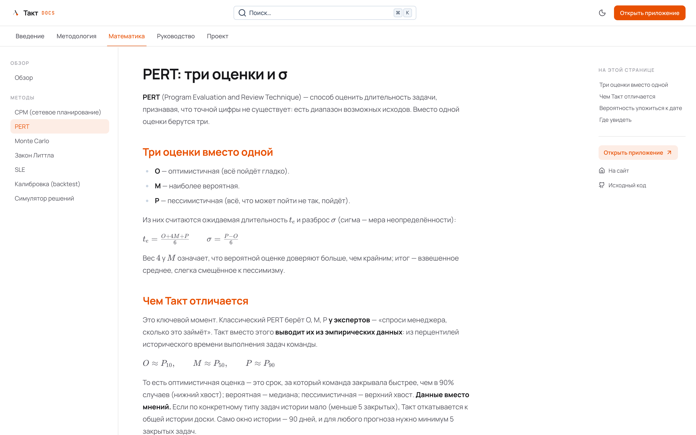
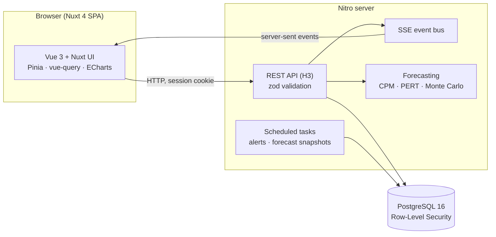

<div align="center">


# Takt

**Sprint deadlines with a probability, not a guess.**

A lightweight Scrumban platform for IT teams: a Kanban board with flow controls,
Scrum sprints, and an analytics layer built on network planning (CPM + PERT)
and Monte Carlo simulation.

[**Live app**](https://takt34.tech) · [**Documentation**](https://takt34.tech/docs) · [**Русская версия**](README.ru.md)


<br>



</div>

---

## Why Takt

Most trackers answer *"what is the status?"*. Takt answers *"when will it be done, and how sure are we?"*.

- **Forecasts from your own history.** Cycle times and throughput of closed tasks feed the estimates, so there is no planning poker for the forecast.
- **Dependencies matter.** A sprint is treated as a network: the critical path and Monte Carlo over the dependency graph give a completion date with P50 / P85.
- **Honest about accuracy.** Every forecast is snapshotted and later compared with the actual outcome (*forecast vs. fact*).
- **Flow controls from Kanban:** WIP limits that actually block, classes of service, SLE-based aging, replenishment cadence.

> Built as a master's thesis project at Volgograd State University. The math is documented in the
> public [docs](https://takt34.tech/docs/math) with formulas and worked examples.

## In action

**What-if simulator.** Shorten two tasks on the critical path and watch the forecast move from 66% to 100%,
while the critical path is rebuilt through the dependency network.



**Board.** Moving a card is applied instantly and committed after a short undo window.



## Screenshots

<table>
  <tr>
    <td width="50%"></td>
    <td width="50%"></td>
  </tr>
  <tr>
    <td><b>Overview.</b> Active sprint with Monte Carlo probability to finish on time, your tasks, activity heatmap.</td>
    <td><b>Sprints.</b> Progress, scope creep, burndown, and a «needs attention» feed of tasks older than P85.</td>
  </tr>
  <tr>
    <td></td>
    <td></td>
  </tr>
  <tr>
    <td><b>Analytics.</b> Cumulative flow, throughput, cycle-time percentiles, Little's-Law WIP recommendations.</td>
    <td><b>What-if simulator.</b> Change estimates or scope and see how the forecast moves; the sprint network highlights the critical path.</td>
  </tr>
  <tr>
    <td></td>
    <td valign="top">
      <b>Documentation.</b> Methodology (Kanban, Scrum, Scrumban) and the math behind every number in the UI: CPM, PERT, Monte Carlo, Little's Law, SLE, calibration.
    </td>
  </tr>
</table>

## Features

| Area | What you get |
|---|---|
| **Board** | Drag-and-drop Kanban, WIP limits with enforced pull, classes of service (Expedite, Fixed date, Standard, Intangible), aging against the SLE, swimlanes, calendar and timeline views |
| **Tasks** | Subtasks, dependencies (blocks / blocked by), checklists, multiple assignees, story points, comments with mentions, full audit trail |
| **Sprints** | Creation wizard with a probabilistic forecast, capacity, burndown, lifecycle event log, close gates with carry-over decisions, immutable reports (CSV export, JSON copy), retrospectives with action items |
| **Forecasting** | CPM critical path, data-driven PERT, Monte Carlo over the dependency network, board-level Monte Carlo, forecast journal and calibration |
| **Notifications** | Real-time updates over SSE, in-app notifications, flow alerts: SLE breach, overdue replenishment, sprint forecast drop |
| **Teams** | Workspaces with roles (owner, admin, scrum master, member, viewer), invitations by link or email, email verification, password reset |

## The math, briefly

**PERT from history, not from experts.** The three estimates come from percentiles of the team's own cycle times:

$$
O \approx P_{10}, \quad M \approx P_{50}, \quad P \approx P_{90}, \qquad
t_e = \frac{O + 4M + P}{6}, \quad \sigma = \frac{P - O}{6}
$$

**CPM + Monte Carlo.** Each task duration is sampled from its PERT distribution, the longest path through the
dependency graph gives one possible sprint length, and 5,000 runs give the distribution: P50, P85, and the
probability to finish by the deadline.

**Little's Law** for WIP recommendations:

$$
\text{WIP} = \text{Throughput} \times \text{Cycle Time}
$$

Details, assumptions and limitations are in the [math section of the docs](https://takt34.tech/docs/math).

## Architecture



- **One Nuxt monorepo:** `app/` (SPA), `server/` (Nitro backend), `shared/` (types used by both).
- **Tenant isolation in the database.** The runtime Postgres role has `NOBYPASSRLS`; every request sets the workspace context before any query, so RLS policies are enforced, not advisory.
- **Append-only event logs** (`task_events`, `sprint_events`) drive the audit trail, CFD, cycle-time analytics and Monte Carlo input.
- **Production:** Docker Compose (app + Postgres + Caddy with automatic TLS) on Yandex Cloud; GitHub Actions builds the image and deploys on every push to `main`.

## Tech stack

| Layer | Technologies |
|---|---|
| Frontend | Nuxt 4 (SPA), Vue 3, TypeScript strict, Nuxt UI v4, Tailwind CSS 4, Pinia, TanStack Vue Query, ECharts, Nuxt Content + KaTeX |
| Backend | Nitro + H3, Drizzle ORM, zod, nuxt-auth-utils (session cookies, scrypt), pino, Server-Sent Events |
| Data | PostgreSQL 16 with Row-Level Security, SQL migrations |
| Testing | Vitest, @nuxt/test-utils, Testcontainers (real Postgres per run) |
| Infra | Docker, Caddy, GitHub Actions, Yandex Cloud |

## Getting started

Requirements: Node.js 22+, [Bun](https://bun.sh), Docker.

```bash
bun install
docker compose -f docker-compose.dev.yml up -d   # Postgres on :5433 + Mailpit
bun run db:migrate
bun run dev                                      # http://localhost:3000
```

**Demo data.** Register an account in the app, then fill a demo workspace with a board, 39 tasks with history, an active sprint and dependencies:

```bash
SEED_OWNER_EMAIL=you@example.com bun run db:seed
```

Other scripts:

```bash
bun run typecheck   # nuxt typecheck
bun run lint        # eslint
bun run test        # e2e tests (needs Docker for Testcontainers)
bun run test:unit   # unit tests
bun run db:studio   # Drizzle Studio
```

<details>
<summary><b>Production deployment</b></summary>

```bash
# on the VM (Ubuntu + Docker)
git clone https://github.com/elClassico-eng/scrumban_app.git
cd scrumban_app
cp .env.prod.example .env    # DOMAIN, LETSENCRYPT_EMAIL, POSTGRES_PASSWORD, NUXT_SESSION_PASSWORD
docker compose -f docker-compose.prod.yml up -d
```

Three services start: `db` (Postgres 16 with the two-role RLS setup), `app` (runs migrations on start, then the Nitro server)
and `caddy` (reverse proxy with a Let's Encrypt certificate). After that, pushes to `main` are deployed by
`.github/workflows/deploy.yml`.

</details>

<details>
<summary><b>Project layout</b></summary>

```
app/                 Nuxt SPA: pages, components, composables, stores
server/
  api/               HTTP handlers (file-based routing)
  services/          business logic
  db/schema/         Drizzle schema
  tasks/             scheduled jobs: flow alerts, daily forecast snapshots
  utils/             auth, tenant context, errors, network-planning math
shared/types/        types shared by app and server
content/docs/        public documentation (methodology, math, project)
drizzle/migrations/  SQL migrations
tests/               e2e tests against a real Postgres
```

</details>

<details>
<summary><b>Project status</b></summary>

| Phase | Scope | Status |
|---|---|---|
| 1 – 4.5 | Auth, workspaces, boards, tasks, sprints, real time, analytics, SPA | ✅ Done |
| 5 | Scrumban flow controls: classes of service, SLE, aging WIP, pull enforcement, replenishment | ✅ Done |
| 6 | Subtasks, dependencies, checklists, calendar and timeline views, design system | ✅ Done |
| 7 | Comments, mentions, notifications, activity log, flow alerts, story points, capacity, burndown | ✅ Done |
| 8 | Network planning core (CPM, PERT, Monte Carlo), forecast calibration, docs site | ✅ Done |
| 8.5 | Sprint wizard, what-if simulator, close gates, sprint reports, retros, reports hub | ✅ Done |
| 10 | Production on Yandex Cloud, CI deploy, auth hardening | ✅ Live |
| 9, 11, 12 | Integrations (GitFlic, Pachca), empirical study | ⏳ Planned |

Numbers as of September 2026: 357 tests (333 e2e + 24 unit), 40 SQL migrations, ~130 API handlers.

</details>

## Author

**Daniil Cherkesov**, master's student at Volgograd State University.
[daniilerkesov122@gmail.com](mailto:daniilerkesov122@gmail.com) · [Telegram](https://t.me/paytina4)
