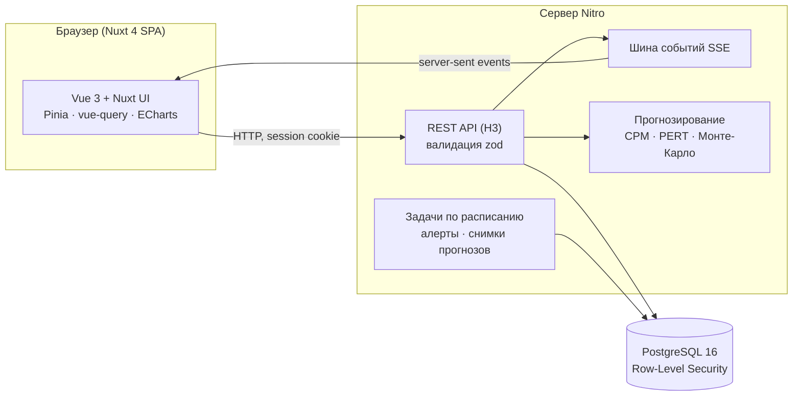

<div align="center">


# Такт

**Сроки спринта – с вероятностью, а не на глаз.**

Лёгкая Scrumban-платформа для IT-команд: Kanban-доска с управлением потоком,
Scrum-спринты и аналитика на основе сетевого планирования (CPM + PERT)
и моделирования Монте-Карло.

[**Открыть приложение**](https://takt34.tech) · [**Документация**](https://takt34.tech/docs) · [**English version**](README.md)


<br>


</div>

---

## Зачем Такт

Большинство трекеров отвечают на вопрос «какой статус?». Такт отвечает на «когда будет готово и насколько мы уверены?».

- **Прогноз по вашей истории.** Оценки строятся из времени выполнения и пропускной способности закрытых задач, а не из покера планирования.
- **Зависимости учитываются.** Спринт рассматривается как сеть: критический путь и Монте-Карло по графу зависимостей дают дату завершения с P50 / P85.
- **Честно о точности.** Каждый прогноз фиксируется и потом сверяется с фактом («прогноз vs факт»).
- **Управление потоком из Kanban:** WIP-лимиты, которые действительно блокируют, классы обслуживания, старение задач относительно SLE, каденс пополнения.

> Проект – магистерская ВКР в Волгоградском государственном университете. Математика описана
> в публичной [документации](https://takt34.tech/docs/math) с формулами и примерами.

## В действии

**Симулятор решений.** Сокращаем две задачи на критическом пути, и прогноз растёт с 66% до 100%,
а критический путь перестраивается по сети зависимостей.


**Доска.** Перенос карточки применяется сразу и фиксируется после короткого окна для отмены.


## Скриншоты

<table>
  <tr>
    <td width="50%"></td>
    <td width="50%"></td>
  </tr>
  <tr>
    <td><b>Обзор.</b> Активный спринт с вероятностью успеть в срок по Монте-Карло, ваши задачи, тепловая карта активности.</td>
    <td><b>Спринты.</b> Прогресс, прирост скоупа, burndown и лента «требует внимания» с задачами старше P85.</td>
  </tr>
  <tr>
    <td></td>
    <td></td>
  </tr>
  <tr>
    <td><b>Аналитика.</b> Cumulative Flow, пропускная способность, перцентили cycle time, рекомендации по WIP по закону Литтла.</td>
    <td><b>Симулятор решений.</b> Меняйте оценки или состав спринта и смотрите, как сдвигается прогноз; сеть спринта подсвечивает критический путь.</td>
  </tr>
  <tr>
    <td></td>
    <td valign="top">
      <b>Документация.</b> Методология (Kanban, Scrum, Scrumban) и математика за каждым числом в интерфейсе: CPM, PERT, Монте-Карло, закон Литтла, SLE, калибровка.
    </td>
  </tr>
</table>

## Возможности

| Раздел | Что есть |
|---|---|
| **Доска** | Kanban с drag-and-drop, WIP-лимиты с pull-системой, классы обслуживания (срочная, с дедлайном, стандартная, фоновая), старение относительно SLE, группировка, календарь и таймлайн |
| **Задачи** | Подзадачи, зависимости (блокирует / заблокирована), чек-листы, несколько исполнителей, story points, комментарии с упоминаниями, полный журнал изменений |
| **Спринты** | Мастер создания с вероятностным прогнозом, capacity, burndown, журнал жизненного цикла, закрытие с решением о переносе задач, неизменяемые отчёты (выгрузка в CSV, копирование в JSON), ретроспективы с action items |
| **Прогнозы** | Критический путь (CPM), PERT по данным, Монте-Карло по сети зависимостей, Монте-Карло по доске, журнал прогнозов и калибровка |
| **Уведомления** | Обновления в реальном времени через SSE, уведомления в приложении, алерты потока: нарушение SLE, просроченное пополнение, падение прогноза спринта |
| **Команды** | Рабочие пространства с ролями (владелец, админ, скрам-мастер, участник, наблюдатель), приглашения по ссылке и email, подтверждение почты, сброс пароля |

## Математика коротко

**PERT по истории, а не по экспертам.** Три оценки берутся из перцентилей времени выполнения задач самой команды:

$$
O \approx P_{10}, \quad M \approx P_{50}, \quad P \approx P_{90}, \qquad
t_e = \frac{O + 4M + P}{6}, \quad \sigma = \frac{P - O}{6}
$$

**CPM + Монте-Карло.** Длительность каждой задачи сэмплируется из её PERT-распределения, самый длинный путь
через граф зависимостей даёт одну возможную длительность спринта, а 5 000 прогонов дают распределение:
P50, P85 и вероятность успеть к дедлайну.

**Закон Литтла** для рекомендаций по WIP:

$$
\text{WIP} = \text{Throughput} \times \text{Cycle Time}
$$

Подробности, допущения и ограничения – в [разделе математики](https://takt34.tech/docs/math).

## Архитектура



- **Один Nuxt-монорепозиторий:** `app/` (SPA), `server/` (бэкенд на Nitro), `shared/` (общие типы).
- **Изоляция команд на уровне БД.** Рабочая роль Postgres имеет `NOBYPASSRLS`; каждый запрос выставляет контекст рабочего пространства до любых запросов, поэтому политики RLS реально применяются.
- **Append-only журналы событий** (`task_events`, `sprint_events`) питают историю изменений, CFD, аналитику cycle time и вход Монте-Карло.
- **Прод:** Docker Compose (приложение + Postgres + Caddy с автоматическим TLS) в Yandex Cloud; GitHub Actions собирает образ и деплоит на каждый push в `main`.

## Стек

| Слой | Технологии |
|---|---|
| Фронтенд | Nuxt 4 (SPA), Vue 3, TypeScript strict, Nuxt UI v4, Tailwind CSS 4, Pinia, TanStack Vue Query, ECharts, Nuxt Content + KaTeX |
| Бэкенд | Nitro + H3, Drizzle ORM, zod, nuxt-auth-utils (session cookies, scrypt), pino, Server-Sent Events |
| Данные | PostgreSQL 16 с Row-Level Security, SQL-миграции |
| Тесты | Vitest, @nuxt/test-utils, Testcontainers (настоящий Postgres на каждый прогон) |
| Инфраструктура | Docker, Caddy, GitHub Actions, Yandex Cloud |

## Быстрый старт

Нужны: Node.js 22+, [Bun](https://bun.sh), Docker.

```bash
bun install
docker compose -f docker-compose.dev.yml up -d   # Postgres на :5433 + Mailpit
bun run db:migrate
bun run dev                                      # http://localhost:3000
```

**Демо-данные.** Зарегистрируйтесь в приложении, затем заполните демо-пространство: доска, 39 задач с историей, активный спринт и зависимости:

```bash
SEED_OWNER_EMAIL=you@example.com bun run db:seed
```

Другие скрипты:

```bash
bun run typecheck   # проверка типов
bun run lint        # eslint
bun run test        # e2e-тесты (нужен Docker для Testcontainers)
bun run test:unit   # unit-тесты
bun run db:studio   # Drizzle Studio
```

<details>
<summary><b>Развёртывание в прод</b></summary>

```bash
# на VM (Ubuntu + Docker)
git clone https://github.com/elClassico-eng/scrumban_app.git
cd scrumban_app
cp .env.prod.example .env    # DOMAIN, LETSENCRYPT_EMAIL, POSTGRES_PASSWORD, NUXT_SESSION_PASSWORD
docker compose -f docker-compose.prod.yml up -d
```

Поднимутся три сервиса: `db` (Postgres 16 с двухролевой схемой для RLS), `app` (применяет миграции при старте,
затем запускает Nitro) и `caddy` (reverse proxy с сертификатом Let's Encrypt). Дальше каждый push в `main`
деплоит `.github/workflows/deploy.yml`.

</details>

<details>
<summary><b>Структура проекта</b></summary>

```
app/                 Nuxt SPA: страницы, компоненты, composables, stores
server/
  api/               HTTP-обработчики (файловый роутинг)
  services/          бизнес-логика
  db/schema/         схема Drizzle
  tasks/             фоновые задачи: алерты потока, ежедневные снимки прогнозов
  utils/             auth, контекст тенанта, ошибки, математика сетевого планирования
shared/types/        типы, общие для app и server
content/docs/        публичная документация (методология, математика, проект)
drizzle/migrations/  SQL-миграции
tests/               e2e-тесты на настоящем Postgres
```

</details>

<details>
<summary><b>Статус проекта</b></summary>

| Фаза | Содержание | Статус |
|---|---|---|
| 1 – 4.5 | Auth, рабочие пространства, доски, задачи, спринты, real time, аналитика, SPA | ✅ Готово |
| 5 | Управление потоком: классы обслуживания, SLE, старение WIP, pull-система, пополнение | ✅ Готово |
| 6 | Подзадачи, зависимости, чек-листы, календарь и таймлайн, дизайн-система | ✅ Готово |
| 7 | Комментарии, упоминания, уведомления, журнал активности, алерты, story points, capacity, burndown | ✅ Готово |
| 8 | Ядро сетевого планирования (CPM, PERT, Монте-Карло), калибровка прогнозов, сайт документации | ✅ Готово |
| 8.5 | Мастер спринта, симулятор решений, закрытие спринта, отчёты, ретро, хаб отчётов | ✅ Готово |
| 10 | Прод в Yandex Cloud, CI-деплой, усиление auth | ✅ Работает |
| 9, 11, 12 | Интеграции (GitFlic, Pachca), эмпирическое исследование | ⏳ В планах |

Цифры на сентябрь 2026: 357 тестов (333 e2e + 24 unit), 40 SQL-миграций, ~130 API-обработчиков.

</details>

## Автор

**Даниил Черкесов**, магистрант Волгоградского государственного университета.
[daniilerkesov122@gmail.com](mailto:daniilerkesov122@gmail.com) · [Telegram](https://t.me/paytina4)
